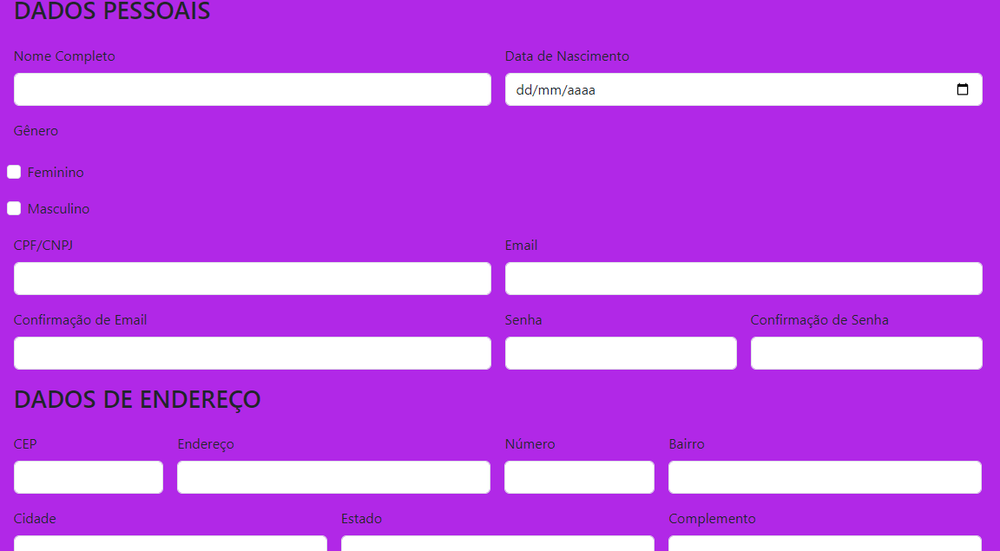

# Formulário de Cadastro Ecommerce

## 🚀 Começando
Nesse projeto, foi criado um Ecommerce na matéria de:
* Fundamentos de Desenvolvimento Web.

## 📋 Sobre o projeto
Projeto criado para obter um Ecommerce e utilizar no 2º Ano do Ensino Médio em prol de construir um site, utilizando o form-Login.
Nessa atividade, foi utilizado 3 tipos de sites de Ecommerce diferentes, são eles:
### Shein
Nele há os seguintes campos: 
* Número de celular/E-mail.
* Localização.
* Uso de captcha.
* Código de verificação.
* Primeiro nome.
* Sobrenome.
* CEP/Código postal.
* Linha de endereço.
* Número.
* Estado/Província.
* Cidade.
* Bairro.
* Número de CPF.
* E-mail de contato.

### Casas Bahia
Nele há os seguintes campos:
* CPF/CNPJ.
* Nome completo. 
* Celular com DDD. 
* Data de nascimento com dia/mês/ano.
* Gênero.
* E-mail.
* Confirme o e-mail.
* Senha.
* Confirme a senha.
* CEP.
* Endereço.
* Bairro.
* Cidade.
* Estado.
* Número.
* Complemento.
* Ponto de referência.
* Tipo de endereço.
* Destinatário.

### Magazine Luiza.
Nele há os seguintes campos:
* E-mail.
* Tipo de conta.
* CPF.
* Nome completo.
* Data de nascimento.
* Senha.
* CEP.
* Endereço.
* Número.
* Complemento.
* Bairro.
* Cidade.
* Estado.
* Ponto de referência.
* Telefone celular.

## O que tem neste cadastro de Ecommerce?
Haverá nesse Ecommerce os seguintes campos:
* Nome completo.
* Data de nascimento. 
* Gênero.
* CPF/CNPJ.
* Número de celular.
* E-mail.
* Confirmação de E-mail.
* Senha.
* Confirmação de senha.
* CEP.
* Endereço.
* Número.
* Bairro
* Cidade.
* Estado.
* Complemento.
* Ponto de referência.

## 🔨Técnicas e Tecnologias utilizadas
* Visual Studio Code 
* Git Bash
* Git Hub
* HTML5
* CSS3
* Live Server (A extensão Live Server permite criar um servidor local através do VSCode. Com ele é cortado a necessidade de sempre que fizer uma alteração no código atualizar o navegador.)
* Bootstrap 5

## 🚧 Fontes utilizadas
* [Alura](https://www.alura.com.br/artigos/escrever-bom-readme)- Como Escrever um README Incrível no seu GitHub.

## ✍🏻Autores
| [ Larissa Gabrielle Fagundes Andrade.](https://github.com/gabriellefagundes) |
| :---: 